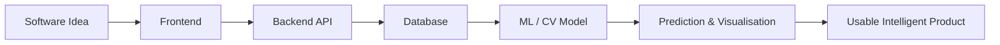
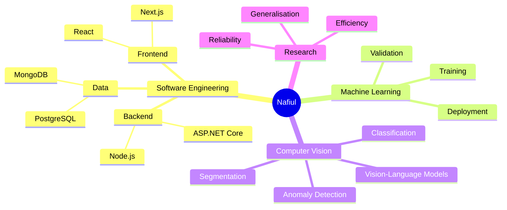

<!--
  Dynamic GitHub Profile README
  Replace placeholder project links when your repositories are ready.
-->

<div align="center">


[](https://git.io/typing-svg)

<a href="mailto:nafiul7islam@gmail.com">
  
</a>
<a href="https://www.linkedin.com/in/nafiul707">
  
</a>
<a href="https://github.com/nafiul707">
  
</a>

<br><br>


</div>

---

## `> whoami`

```yaml
name: Nafiul Islam
role:
  - Aspiring Software Engineer
  - Full-Stack Developer
  - Machine Learning & Computer Vision Enthusiast

education: Computer Science and Engineering at AIUB

building:
  - Responsive web applications
  - RESTful APIs and backend services
  - AI-powered software
  - Computer vision experiments

currently_exploring:
  - Industrial anomaly detection
  - Image classification and segmentation
  - Vision-language models
  - Reliable memory and prototype refinement

goal: Build practical software systems that connect modern engineering with intelligent vision
```

---

## What I Build

<div align="center">


</div>

<br>

### 🌐 Software Engineering

I build responsive and scalable applications using modern frontend and backend technologies. My software work includes interface design, API development, authentication, database integration, and complete application workflows.

### 🧠 Machine Learning

I work with data preprocessing, model training, validation, performance analysis, and reproducible experimentation using Python-based ML tools.

### 👁️ Computer Vision

My computer vision interests include image classification, segmentation, industrial defect detection, anomaly localization, robustness analysis, and vision-language models.

---

## Tech Universe

### Languages

<div align="center">

[](https://skillicons.dev)

</div>

### Frontend

<div align="center">

[](https://skillicons.dev)

</div>

### Backend & Databases

<div align="center">

[](https://skillicons.dev)

</div>

### Machine Learning & Computer Vision

<div align="center">

[](https://skillicons.dev)

</div>

### Tools & Workflow

<div align="center">

[](https://skillicons.dev)

</div>

---

## Current Focus



- Building stronger foundations in **JavaScript, React, Next.js, Node.js, and API development**
- Developing **PyTorch-based computer vision workflows**
- Studying **zero-shot and few-shot industrial anomaly detection**
- Exploring **CLIP and vision-language models**
- Improving **model evaluation, robustness, and reproducibility**
- Learning how to deploy ML models inside real software systems

---

## Computer Vision Lab

<details open>
<summary><b>🔍 Industrial Anomaly Detection</b></summary>
<br>

Working on research-oriented ideas involving:

- Zero-shot and few-shot defect detection
- Pixel-level anomaly localisation
- CLIP/VLM-based visual understanding
- Dynamic memory and prototype refinement
- Cross-dataset generalisation
- Reliable anomaly scoring
- Efficient and practical deployment

</details>

<details>
<summary><b>🧬 Medical and Histopathology Image Analysis</b></summary>
<br>

Experimenting with:

- CNN and ResNet-based classification
- RGB and grayscale model comparison
- Robustness under colour and noise perturbations
- External dataset validation
- Confusion-matrix and class-wise error analysis
- Hybrid visual feature learning

</details>

<details>
<summary><b>📊 ML Experiment Workflow</b></summary>
<br>

```text
Dataset
   ↓
Preprocessing and Augmentation
   ↓
Feature Extraction / Model Training
   ↓
Validation and External Testing
   ↓
Metrics, Confusion Matrix and Error Analysis
   ↓
Model Improvement and Deployment
```

</details>

---

## Project Space

<details open>
<summary><b>🌐 Full-Stack Web Application</b></summary>
<br>

**Stack:** HTML, CSS, JavaScript, React, Node.js, Express, MongoDB

A complete web application direction involving responsive UI development, authentication, API communication, database operations, and structured frontend-backend integration.

</details>

<details>
<summary><b>🔍 Industrial Anomaly Detection Research</b></summary>
<br>

**Stack:** Python, PyTorch, OpenCV, CLIP, ViT

Research work focused on detecting and localising visual defects while improving reliability, generalisation, and computational efficiency.

</details>

<details>
<summary><b>🧬 Histopathology Computer Vision Experiments</b></summary>
<br>

**Stack:** Python, PyTorch, ResNet, image preprocessing

Deep-learning experiments involving classification, colour-versus-texture comparison, robustness evaluation, and external validation.

</details>

<details>
<summary><b>🤖 AI-Powered Application</b></summary>
<br>

**Stack:** Python, LLM APIs, LangChain, RAG

An intelligent application direction that combines document retrieval, contextual response generation, and software integration.

</details>

<details>
<summary><b>⚙️ ASP.NET Core API</b></summary>
<br>

**Stack:** C#, ASP.NET Core, Entity Framework, PostgreSQL

A backend project focused on RESTful services, structured data access, validation, and the .NET ecosystem.

</details>

<details>
<summary><b>🧠 Algorithms and Problem Solving</b></summary>
<br>

**Stack:** C++, Python

A growing collection of data structures, algorithms, and problem-solving exercises.

</details>

---

## Mission Control

<div align="center">


</div>

<br>

<table>
<tr>
<td width="50%" valign="top">

### 🚧 Currently Building

- Full-stack applications with modern JavaScript
- RESTful APIs and structured backend services
- ML-powered features for practical software
- Interactive interfaces for model predictions

</td>
<td width="50%" valign="top">

### 🔬 Currently Researching

- Industrial visual anomaly detection
- Zero-shot and few-shot computer vision
- Vision-language models and CLIP
- Reliable memory and prototype refinement

</td>
</tr>
<tr>
<td width="50%" valign="top">

### ⚡ Currently Improving

- React and Next.js architecture
- PyTorch training pipelines
- Model robustness and evaluation
- Deployment and MLOps foundations

</td>
<td width="50%" valign="top">

### 🎯 Long-Term Mission

Build reliable intelligent systems where:

**Software Engineering + Machine Learning + Computer Vision**

work together to solve real-world problems.

</td>
</tr>
</table>



---


## GitHub Pulse

<div align="center">

[](https://git.io/typing-svg)

<br>


<a href="https://github.com/nafiul707?tab=followers">
  
</a>
<a href="https://github.com/nafiul707?tab=repositories">
  
</a>

<br><br>

<picture>
  <source
    media="(prefers-color-scheme: dark)"
    srcset="https://github-readme-stats.vercel.app/api?username=nafiul707&show_icons=true&theme=tokyonight&hide_border=true&include_all_commits=true&count_private=true&rank_icon=github"
  />
  <source
    media="(prefers-color-scheme: light)"
    srcset="https://github-readme-stats.vercel.app/api?username=nafiul707&show_icons=true&theme=default&hide_border=true&include_all_commits=true&count_private=true&rank_icon=github"
  />
  
</picture>

<picture>
  <source
    media="(prefers-color-scheme: dark)"
    srcset="https://github-readme-stats.vercel.app/api/top-langs/?username=nafiul707&layout=compact&theme=tokyonight&hide_border=true&langs_count=8"
  />
  <source
    media="(prefers-color-scheme: light)"
    srcset="https://github-readme-stats.vercel.app/api/top-langs/?username=nafiul707&layout=compact&theme=default&hide_border=true&langs_count=8"
  />
  
</picture>

<br><br>


</div>

<details>
<summary><b>📈 Open Contribution Activity</b></summary>
<br>

<div align="center">


</div>

</details>

---

## Let's Connect

<div align="center">

I am interested in **software engineering, machine learning, computer vision, research collaboration, and intelligent application development**.

<br>

<a href="mailto:nafiul7islam@gmail.com">
  
</a>
<a href="https://www.linkedin.com/in/nafiul707">
  
</a>
<a href="https://github.com/nafiul707">
  
</a>

<br><br>


</div>
