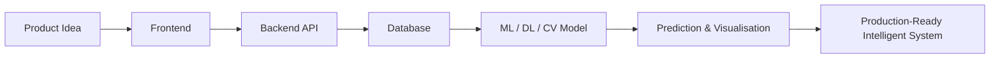
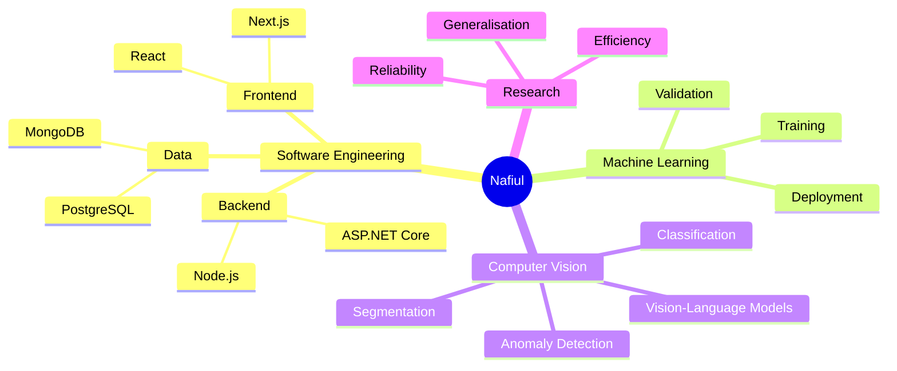

<!--
  Dynamic GitHub Profile README
  Replace placeholder project links when your repositories are ready.
-->

  

---

---

## What I Build

 

<table>
<tr>
<td width="50%" valign="top">

### 🌐 Full-Stack Products

I build complete web applications from interface to database.

**What I work with:**

- Responsive and accessible user interfaces
- React and Next.js component-based applications
- RESTful APIs with Node.js, Express, and ASP.NET Core
- Authentication, validation, and structured backend logic
- MongoDB and PostgreSQL integration

</td>
<td width="50%" valign="top">

### ⚙️ Backend Engineering

I design the systems that power reliable software products.

**What I focus on:**

- Clean API architecture
- CRUD workflows and business logic
- Secure authentication and protected routes
- Database modelling and query optimisation
- Maintainable and scalable code structure

</td>
</tr>

<tr>
<td width="50%" valign="top">

### 🧠 Machine Learning

I develop data-driven solutions and evaluate models beyond basic accuracy.

**What I work on:**

- Data preprocessing and feature preparation
- Model training, validation, and comparison
- Classification and prediction workflows
- Performance analysis using precision, recall, F1, and AUROC
- Reproducible experimentation with Python

</td>
<td width="50%" valign="top">

### 🔥 Deep Learning

I work with neural networks for complex visual-learning tasks.

**What I explore:**

- CNN and ResNet-based architectures
- Transfer learning and fine-tuning
- Vision Transformers and CLIP-based models
- Robustness under colour, noise, and domain shifts
- GPU-based experiments using PyTorch

</td>
</tr>

<tr>
<td width="50%" valign="top">

### 👁️ Computer Vision

I build and study systems that understand visual data.

**What I work on:**

- Image classification and segmentation
- Industrial defect and anomaly detection
- Pixel-level anomaly localisation
- Histopathology image analysis
- Vision-language model applications

</td>
<td width="50%" valign="top">

### 🚀 Intelligent Software

My main direction is combining software engineering with ML, DL, and computer vision.

**The goal:**

- Serve trained models through APIs
- Build interfaces for predictions and visualisations
- Connect models with databases and real workflows
- Turn research prototypes into usable products
- Create scalable AI-powered applications

</td>
</tr>
</table>

### From idea to intelligent product

---

---

---

---

---

## Mission Control

 

<table>
<tr>
<td width="50%" valign="top">

### 🚧 Currently Building

- Full-stack applications with modern JavaScript
- RESTful APIs and structured backend services
- ML-powered features for practical software
- Interactive interfaces for model predictions

</td>
<td width="50%" valign="top">

### 🔬 Currently Researching

- Industrial visual anomaly detection
- Zero-shot and few-shot computer vision
- Vision-language models and CLIP
- Reliable memory and prototype refinement

</td>
</tr>
<tr>
<td width="50%" valign="top">

### ⚡ Currently Improving

- React and Next.js architecture
- PyTorch training pipelines
- Model robustness and evaluation
- Deployment and MLOps foundations

</td>
<td width="50%" valign="top">

### 🎯 Long-Term Mission

Build reliable intelligent systems where:

**Software Engineering + Machine Learning + Computer Vision**

work together to solve real-world problems.

</td>
</tr>
</table>

---

## GitHub Pulse

 

  

 

 

 

### Languages & Technologies

> The language cards are calculated from public GitHub repositories. The technology icon row remains visible as a fallback display of the tools used in my software and computer vision work.

---

## Let's Connect

I am interested in **software engineering, machine learning, computer vision, research collaboration, and intelligent application development**.

 

  

